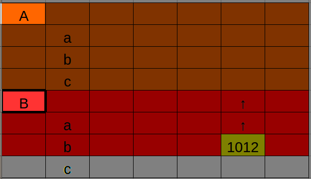

### Example recipe

The recipes are written in a special language. They look like this:

```python
from databaker.constants import *

def per_file(tableset):
    return tableset

def per_tab(tab):
    obs = tab.filter("MGSL").assert_one().shift(DOWN).fill(RIGHT).fill(DOWN).is_number().is_not_italic()

    tab.col('A').one_of(['Male', 'Female', 'All Persons']).dimension('gender', CLOSEST, ABOVE)
    tab.col('A').is_date().dimension(TIME, DIRECTLY, LEFT)
    tab.regex("All aged .*").dimension('ages', CLOSEST, ABOVE)
    tab.filter("Total economically active").fill(LEFT).fill(RIGHT).is_not_blank().dimension('indicator_', DIRECTLY, ABOVE)

    return obs
```

You can just edit or copy recipes to make basic changes. If you need to do anything
more complicated, it is worth knowing they are written in the Python programming
language. There's lots of online help and training for Python.

### Header line
```python
from databaker.constants import *
```

This is just boilerplate: it needs to be at the start of each file.

### Per File
```python
def per_file(tableset):
    ...
    return wanted_sheets
```

Here we say which tabs in the Excel spreadsheet we're interested in.

Options include:

* Explicit names of tables as strings
 
```python
def per_file(tabs):
    return "My Table"                    # one table called 'My Table'
    # or
    return ["This Table", "That Table"]  # two tables with specific names
    # or
    return "*"                           # all tables
```

* Using a list of table names to inform decisions:

```python
def per_file(tabs):
    tablist = tabs.names         # get a list of names
    tablist.discard('Notes')     # remove names from list
    tablist.discard('CV notes')
    return tablist
```

* Returning the tables themselves

```python
def per_file(tabs):
    return tabs  # all tables
```

This last one is potentially useful for selecting tables based on the contents of their cells:

```python
def per_file(tabs):
    for tab in tabs:
        if tab.excel_ref("A1").value == '2015':
            yield tab
```

### Per Tab
```python
def per_tab(tab):
    ....
    return observations
```

As sugggested by the name, this code is run for every tab in the spreadsheet. It needs to return the observations and tell the tab which cells are which headers.

These are done with:

```python
def per_tab(tab):
    tab.dimension('table_header', selector().value)  # get text describing sheet - dark blue
    tab.selector().dimension(GEOG, DIRECTLY, LEFT)  # places - red
    tab.selector().dimension('top_header', DIRECTLY, ABOVE)  # what the number is - green 
    obs = tab.selector()  # observations - yellow
    return obs
```

(in this example, selector() is just a placeholder for 'now pick which cells are relevant' - i.e. each of the individual sets of coloured cells below: for real selectors, see the [function reference](function_reference.html). )


#### .dimension(_name_, _string_)
#### .dimension(_name_, _method_, _direction_)

For dimensions that are the same for all observations on a tab, a literal string can be used. (This might be `tab.name`, the name of the tab, or a selector which selects a single cell followed by `.value`)

Otherwise, we need to say how to get from the observations to the headers: we need to specify whether we stay in the same column or row (`DIRECTLY`) or just need to get the closest in that direction, regardless (`CLOSEST`).

The region examined for headers typically includes the row/column the observation is in.

Note how `DIRECTLY` vs `CLOSEST` changes which cell is selected:


[above: `DIRECTLY, LEFT`]


[above: `CLOSEST, LEFT`]

This does lead to slightly counterintuitive behaviour when selecting `DIRECTLY` and `CLOSEST` cells which are off in one direction from the observations.

For the table below, we'd look for lowercase letters using `DIRECTLY, LEFT`, but for the uppercase letters with  `CLOSEST, ABOVE`. 


[above: to look `DIRECTLY` in the same row, you need the closest cell to the `LEFT`]



[above: whereas the `CLOSEST` is found at the closest relevant cell `ABOVE` it]

#### Dimensions

Dimensions such as `DATAMARKER`, `TIME`, `TIMEUNIT` and `GEOG` have special places in the output CSV format.
Dimensions which are strings are appended to the end of each row.

##### `DATAMARKER`

If an observation isn't a number, `DATAMARKER` is automatically populated with the value instead, and the observation field is left empty.

This won't happen if the `DATAMARKER` field isn't blank; you'll get a warning instead.

##### `TIME` and `TIMEUNIT`

`TIMEUNIT` is automatically populated if `TIME` contains a well-formatted date-string. (Doesn't work on Excel date-formatted items, yet. Yell if that's a problem.)

Well formatted date string examples: `2000` (Year); `2000 Q1` and `Jan-Mar 2000` (Quarter); `Jan 2000` (Month).
