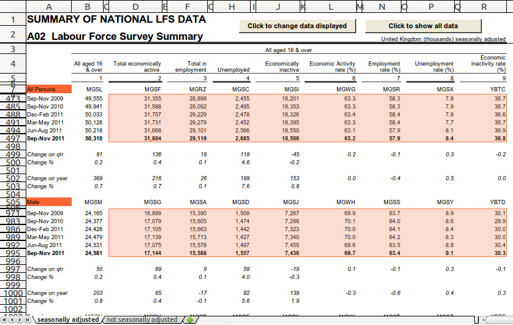
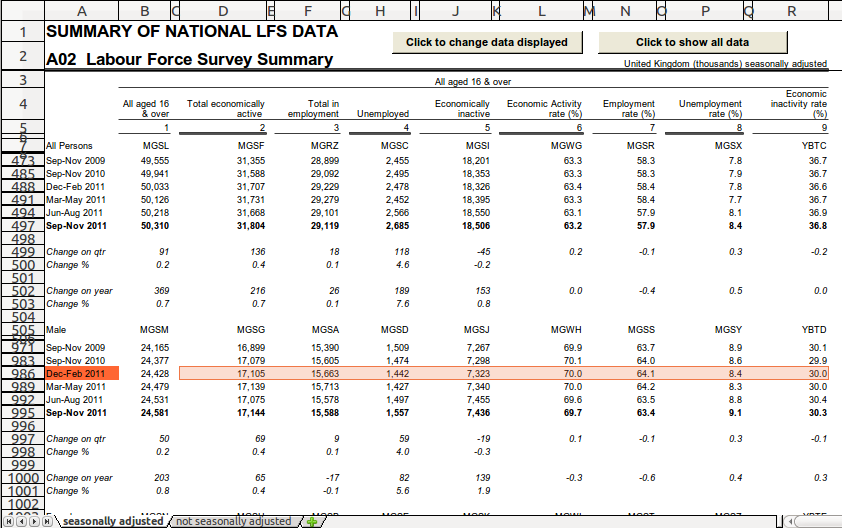

## Explaining the recipe a02.py
 
The spreadsheet we're going to extract data from is `a02.xls`. It's
available [here](https://github.com/scraperwiki/eot-recipes) together
with the recipe `a02.py` which we're going to walk through
step-by-step in this tutorial.

A snippet of the spreadsheet is shown below:


We want to extract all the observations from the tabs, *except* the combined
"all aged 16 & over" data. The change data aren't observations so we
should ignore these too.

We can run the recipe by placing `a02.py` in the same directory as `a02.xls`
and running `bake a02.py a02.xls` while in that directory at the Windows
command line.

### Importing constants

```python
from databaker.constants import *
```

This line makes it possible to use any of the following in the recipe:

* dimensions (`DATAMARKER`, `GEOG`, `OBS`, `TIME`, `TIMEUNIT`);
* directions (`ABOVE`, `BELOW`, `LEFT`, `RIGHT`);
* selection specifiers (`CLOSEST`, `DIRECTLY`).

Without them, the recipe will fail with a "`NameError`" as the recipe
doesn't know how these special constants are defined.

### `per_file`

```python
def per_file(tableset):
    return "*"
```
 
This selects *all* of the spreadsheet tabs: we will extract
data from both the `seasonally adjusted` and the `not seasonally
adjusted` tabs.

For this spreadsheet, the tab layouts are similar enough that we can use
the same recipe code for all the tabs.

### `per_tab`

```python
def per_tab(tab):
    obs = tab.filter("MGSL").assert_one().shift(DOWN).fill(RIGHT).fill(DOWN).is_number().is_not_italic()
    tab.col('A').one_of(['Male', 'Female', 'All Persons']).dimension('gender', CLOSEST, ABOVE)
    tab.col('A').is_date().dimension(TIME, DIRECTLY, LEFT)
    tab.regex("All aged .*").dimension('ages', CLOSEST, UP)
    tab.filter("Total economically active").fill(LEFT).fill(RIGHT).is_not_blank().dimension('indicator', DIRECTLY, ABOVE)
    tab.dimension('adjusted_yn', tab.name)
    return obs
```

For each tab we've selected, `per_tab` does the following things.

#### Selecting cells

##### Line 1

`tab.filter("MGSL")`
 
This only returns cells that match the text "MGSL". In this
spreadsheet, there's only one match at cell B7, so this filter returns
this cell.
 
We can confirm this by then doing `.assert_one()`. Why do this if we
already know there's only one cell that matches? It means that we can
reuse this recipe on new version of the spreadsheets but have it warn us
if it finds multiple entries — or none at all. It's possible that
whoever creates the next version of the spreadsheet might, for instance,
merge the two tabs into one. `assert_one()` would warn us of this.
 
From cell B7, `shift(DOWN)` now gives us the one cell down from the one that
contained MGSL, so we've now selected cell B8.
 
`fill(RIGHT)` and `fill(DOWN)` then select all cells to the right and down of
cell B8, so we skip that first header row and the first column.

The image below shows us the selection at this stage:


Now we've selected the cells that are to the right and down of B7
which contain the data we want. But, we're only interested in the
observations, so we don't want to extract the four character codes or
the change values.

The character codes are easily distinguished from the observations as
they are text, not numbers. And the change values are in italics.

So, we can use `is_number()` and `is_not_italic()` to get only the
observation cells.

Below illustrates the selection we've made:


These selected cells are stored in a variable called `obs`.

#### Specifying the dimensions

For each observation, we want to add certain dimensions. The following
lines specify which dimensions we will retrieve for each observation.

```python
tab.col('A').one_of(['Male', 'Female', 'All Persons']).dimension('gender', CLOSEST, ABOVE)
tab.col('A').is_date().dimension(TIME, DIRECTLY, LEFT)
tab.regex("All aged .*").dimension('ages', CLOSEST, UP)
tab.filter("Total economically active").fill(LEFT).fill(RIGHT).is_not_blank().dimension('indicator', DIRECTLY, ABOVE)
```

Here, the dimensions that we want to retrieve for each cell in `obs` are
themselves specified by the contents of cells.

These four lines all add dimensions to be retrieved for each cell in the
selected data, `obs`, but use different approaches to locate the cell
containing the dimension information.

##### Line 2 

The `tab.col('A')` in line 2 (L2) and line 3 selects cells in column A
of the tab.

Next, of the cells in column A, `one_of` selects those that match the
text `Male`, `Female` or `All Persons`.

`.dimension('gender', CLOSEST, ABOVE)` specifies what we want to call
the dimension in the output — "gender" — along with how we get to the
gender cell that corresponds to an observation cell.

We look for the `CLOSEST` cell of this selection that's `ABOVE` the row
where the observation lies.

This is illustrated below. The solid orange cells are the gender cells
that we selected in this line of the recipe. The light orange selection
represent cells in `obs`. For any cell in the first selection of `obs`
cells (rows 473-497), the closest above gender dimension is "All
Persons". For cells in the second selection of `obs` cells (rows
971-995), the closest above gender dimension is "Male".



##### Line 3

First, we do the same as in L2, selecting all cells in column A.

This time we're looking for cells containing a date, which we select
using `is_date()`.

`.dimension(TIME, DIRECTLY, LEFT)`

We then specify that this corresponds to the special TIME dimension and
that this data lies `DIRECTLY` to the left of the current cell.

Below we show an example of this again. For this one particular row of
`obs` cells shown, the dimension we select for each cell in the row directly
left date to each of those cells is `Dec-Feb 2011`. (Each row of `obs`
cells likewise has a corresponding date that will be stored for each
observation.)



##### Line 4

`tab.regex("All aged .\*")` uses a regular expression to find cells
anywhere in the tab that contain `All aged ` (notice the space) followed
by any text.

Selected cells are shown below highlighted orange:


The `.*` means match any character (represented by `.`) and we've specified
using the `*` that we don't mind how many characters follow `All aged `.

This way we match the cells in the spreadsheet that
contain `All aged 16 & over` and `All aged 16 to 64`.

`.dimension('ages', CLOSEST, UP)` labels this dimension as `ages` and
specifies that we want the closest cell above. So we're again finding
the closest cell to each one in our selection.

(UP and ABOVE mean the same thing.)

In the case below, the CLOSEST matching dimension cell UP from any selected
cell in `obs` as shown is B4.


(Note that the examples in the images are truncated forms of the full
spreadsheets. In the full spreadsheet, the cell `All aged 16 to 64` also
matches this age regex. The selected `obs` cells that are below this
"All aged 16 to 64" cell will actually have that as their corresponding
dimension, as that cell would be the CLOSEST UP from them, closer than
the `All aged 16 & over`.)


##### Line 5

`tab.filter("Total economically active").fill(LEFT).fill(RIGHT).is_not_blank().dimension('indicator', DIRECTLY, ABOVE)`

Here we first find cells that contain exactly `Total economically
active`. For all of the cells in this selection, we then select all cells
to the left and right of these with `.fill(LEFT)` and `.fill(RIGHT)`:


As shown, this also includes lots of blank cells, those to either side
of the headers as well as the empty cells between headers (e.g. C4,
E4...)

The image below shows the effect of `is_not_blank()`: it removes these
unwanted and empty cells.


`.dimension('indicator', DIRECTLY, ABOVE)` labels the cell in this
selection directly above each cell of interest as `indicator`.

##### Line 6

`tab.dimension('adjusted_yn', tab.name)`

This line explicitly sets a dimension item to be the name of the
current tab (`tab.name`). It doesn't actually consider any of the
cells in the spreadsheet at all.

This only works for text which doesn't depend on the
particular observation — so typically things which are the same
for all observations on the tab.

So, for this dimension, the values will be
`seasonally adjusted` or `not seasonally adjusted` depending on which
tab the observation was found.

#### Extracting the data with the dimensions

##### Line 7

`return obs` then tells `databaker` that it's the end of the recipe
and we've finished selecting observations and dimensions. If we run
this recipe, the output data will be generated containing the
observations and dimensions we've chosen in it.
