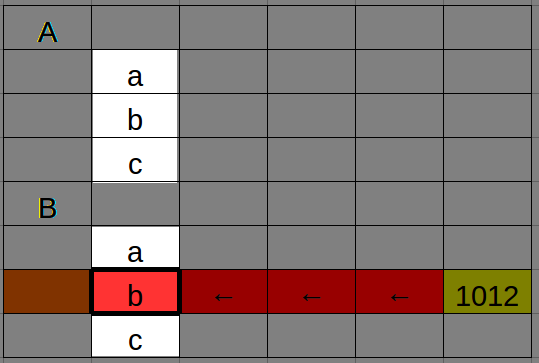

### Example recipe

The recipes are written in a special language. They look like this:

```python
from databaker.constants import *

def per_file(tableset):
    return "*"

def per_tab(tab):
    obs = tab.filter("MGSL").assert_one().shift(DOWN).fill(RIGHT).fill(DOWN).filter(is_number).is_not_italic

    tab.col('A').one_of(['Male', 'Female', 'All Persons']).is_header('gender', UP)
    tab.col('A').regex("...-... (?:19|20)\d\d").is_header(TIME, LEFT, strict=True)
    tab.regex("All aged .*").is_header('ages', UP)
    tab.filter("Total economically active").fill(LEFT).fill(RIGHT).is_not_blank.is_header('indicator_', UP, strict=True)

    return obs
```

You can just edit or copy recipes to make basic changes. If you need to do anything
more complicated, it is worth knowing they are written in the Python programming
language. There's lots of online help and training for Python.

### Header line
```python
from databaker.constants import *
```

This is just boilerplate: it needs to be at the start of each file.

### Per File
```python
def per_file(tableset):
    ...
    return wanted_sheets
```

Here we say which tabs in the Excel spreadsheet we're interested in.

Options include:

* Explicit names of tables as strings
 
```python
def per_file(tabs):
    return "My Table"                    # one table called 'My Table'
    # or
    return ["This Table", "That Table"]  # two tables with specific names
    # or
    return "*"                           # all tables
```

* Using a list of table names to inform decisions:

```python
def per_file(tabs):
    tablist = tabs.names         # get a list of names
    tablist.discard('Notes')     # remove names from list
    tablist.discard('CV notes')
    return tablist
```

* Returning the tables themselves

```python
def per_file(tabs):
    return tabs  # all tables
```

This last one is potentially useful for selecting tables based on the contents of their cells:

```python
def per_file(tabs):
    for tab in tabs:
        if tab.excel_ref("A1").value == '2015':
            yield tab
```

### Per Tab
```python
def per_tab(tab):
    ....
    return observations
```

As sugggested by the name, this code is run for every tab in the spreadsheet. It needs to return the observations and tell the tab which cells are which headers.

These are done with:

```python
def per_tab(tab):
    tab.selector().is_header('age_range', UP)
    tab.selector().is_header(TIME, LEFT, STRICT)
    tab.set_header(GEOG, "W06000022")
    obs = tab.selector()
    return obs
```

(in this example, selector() is just a placeholder for 'now pick which cells are relevant' - i.e. the coloured cells below)


#### `.is_header` and `.set_header`

Headers are specified with dimension names (see below), the significant direction (typically `UP` or `LEFT`, rarely `DOWN` or `RIGHT`) and whether we remain in the same row or column as the observation (`STRICT`).

The region examined for headers typically includes the row/column the observation is in.

Note how `STRICT` changes which cell is selected:


[above: `LEFT, STRICT`]


[above: `LEFT`]

This does lead to slightly counterintuitive behaviour when selecting strict and non-strict cells which are off in one direction:

the first uses `LEFT, STRICT` whereas the second uses `UP`


[above: to look `STRICT`ly in the same row, you need to look `LEFT`


[above: whereas non-`STRICT` looks use `LEFT`.

We may change how this works to make it clearer.

#### Dimensions

Dimensions such as `DATAMARKER`, `TIME`, `TIMEUNIT` and `GEOG` have special places in the output CSV format.
Dimensions which are strings are appended to the end of each row, [TODO: in the order they're specified].

##### `DATAMARKER`

If an observation isn't a number, `DATAMARKER` is automatically populated with the value instead, and the observation field is left empty.

This won't happen if the `DATAMARKER` field isn't blank; you'll get a warning instead

##### `TIMEUNIT`

